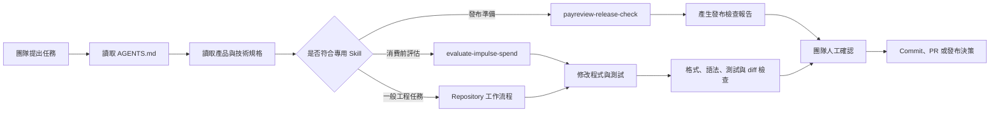

# PayReview Agentic AI 與團隊協作

## 一、目的

PayReview 使用 Agentic AI 協助團隊將產品規格轉換成可驗證的設計、程式、測試及發布報告。Agent 是受規則約束的工程協作者，不是產品決策者，也不是財務結果的資料來源。

Agentic AI 在本專案中的主要價值是：

1. 在開始修改前讀取一致的產品與工程規則。
2. 依任務載入專用 Skill，執行可重複的工作流程。
3. 將產品、金融、UI、資料與發布需求連結到實際檔案和測試。
4. 在提交前檢查衝突、隱私、資料完整性與未驗證風險。
5. 將最後決策與高風險操作保留給團隊成員。

## 二、Agentic AI 實作架構

### 1. Repository 規則層

[AGENTS.md](../AGENTS.md) 是所有 Agent 與貢獻者共同遵循的入口，定義：

- 指令與規格的優先順序。
- 產品語氣與不可羞辱使用者的原則。
- 金額、日期、目標與交易完整性規則。
- SwiftUI、Repository、Firebase 與服務層界線。
- Authentication、Firestore、隱私、訂閱與分析限制。
- 測試、Git、Pull Request 與發布要求。

Agent 必須先確認任務是否涉及尚未決定的金融行為、雲端架構、付費功能、資料蒐集、帳號刪除或發布範圍。若缺少的決策會實質改變結果，必須停止並交由團隊確認。

### 2. 產品與技術規格層

Agent 依任務讀取下列來源：

- [PRODUCT_PLAN_V0.2.md](../PRODUCT_PLAN_V0.2.md)：產品行為、文案與品牌方向。
- [PRODUCT_LAUNCH_PLAN_V0.2.md](../PRODUCT_LAUNCH_PLAN_V0.2.md)：啟用、訂閱、分析及發布營運。
- [TECH_STACK.md](../TECH_STACK.md)：已核准的技術方向與架構界線。
- [Firestore 資料模型](firestore-data-model.md)：雲端資料結構與同步規則。

Agent 不可用生成內容覆蓋正式金融規格，也不可為了通過測試而降低既有產品規則。

## 三、專用 Skill 功能

### `evaluate-impulse-spend`

檔案位置：[skills/evaluate-impulse-spend/SKILL.md](../skills/evaluate-impulse-spend/SKILL.md)

此 Skill 用於消費前評估、Decision Card、安心可花金額、目標影響與購買／延後／略過流程。

主要功能：

1. 收集金額、幣別、時間、時區、彈性預算、確認支出、預期支出及受保護目標等必要輸入。
2. 驗證負數、資料過期、日期邊界與內部資料不一致等問題。
3. 先保留必要支出與最低目標提撥，再計算保守與樂觀的安心可花範圍。
4. 將結果分類為 `within_flexible`、`uses_buffer`、`requires_plan_change` 或 `insufficient_data`。
5. 分別分析從彈性預算支付、保護目標日期及使用者主動動用目標基金的情境。
6. 產生具體恢復方案，但不自動變更計畫或目標日期。
7. 保存計算輸入、假設、資料新鮮度、時區、規則版本與 Decision Snapshot。
8. 確保評估情境保持暫存，只有使用者確認購買並記錄後才建立正式交易。
9. 驗證金額邊界、支出範圍、目標變化、日期邊界及避免重複扣除等案例。

此 Skill 不允許 Agent 自行發明、修改、獨立四捨五入或覆蓋 FinanceEngine 的結果。

### `payreview-release-check`

檔案位置：[skills/payreview-release-check/SKILL.md](../skills/payreview-release-check/SKILL.md)

此 Skill 用於 TestFlight、App Store 審核、預購與正式發布前的重複檢查。

主要功能：

1. 收集版本、build、發布類型、目標日期、變更內容、訂閱方案及 reviewer account。
2. 檢查消費評估、交易確認、目標影響及預期支出是否有重複扣除。
3. 檢查登入、Firestore 權限、資料匯出、帳號刪除、離線寫入與跨帳號快取隔離。
4. 檢查 StoreKit 商品、試用資格、續訂資訊、取消方式與 Restore Purchases。
5. 檢查 App Store metadata、review notes、支援頁面、隱私政策、條款及 FAQ。
6. 檢查第三方授權聲明、客服管道、分析事件與 crash reporting 是否洩漏敏感資料。
7. 檢查 build signing、版本號、測試結果與發布權限。
8. 將每個項目標記為 `pass`、`block` 或 `not applicable`。
9. 在金融完整性、隱私、帳號刪除、安全性、訂閱揭露或重大 crash 受阻時輸出 `NO-GO`。

Skill 只能產生檢查與建議。上傳 build、提交審核、開啟預購或公開發布都需要產品負責人的明確批准。

## 四、Agent 任務執行流程

每個實作任務依序執行：

1. 確認使用者要求、工作分支與未提交變更。
2. 讀取相關產品文件、Skill、鄰近程式碼與測試。
3. 找出未決定事項、資料風險及架構衝突。
4. 實作滿足需求的最小完整變更。
5. 維持 FinanceEngine、UI、Persistence、Authentication 與 Analytics 的責任分離。
6. 新增或更新與風險相稱的測試。
7. 執行格式、語法、靜態檢查、測試及 `git diff --check`。
8. 檢查最終 diff 是否包含秘密、個人資料、無關檔案或意外行為變更。
9. 由團隊成員 review 後才合併或執行外部發布動作。

## 五、人與 Agent 的權責界線

| 項目 | Agent 可以執行 | 必須由團隊確認 |
| --- | --- | --- |
| 規格理解 | 讀取、比對並指出衝突 | 核准新的產品或金融規則 |
| 程式實作 | 修改程式、測試與文件 | 接受重大架構、資料或付費範圍變更 |
| 財務結果 | 呼叫並解釋確定性計算結果 | 修改計算規則、假設或目標政策 |
| Git 工作 | 建立分支、commit、push、草稿 PR | Merge、rebase、force-push 或刪除分支 |
| 發布準備 | 執行檢查並產生 GO／NO-GO 報告 | TestFlight、App Store 送審、預購及正式發布 |
| 外部溝通 | 起草 release notes 或 reviewer notes | 對外發布、送出訊息或承諾時程 |

## 六、團隊分工

下表依目前 repository 的 commit authorship 與主要修改範圍整理。正式職稱與責任歸屬仍應由團隊確認。

| 成員 | 主要角色 | 核心工作 | Agentic AI 責任 |
| --- | --- | --- | --- |
| Cady | TPM | 技術專案管理、開發時程、跨功能協調、技術決策、專用 Skill 與 Agentic AI 流程整合 | 拆解技術里程碑、協調 Agent 任務與依賴、維護 repository 規則與 Skill、追蹤驗證與交付狀態 |
| Micheal（machshyi） | PM | 產品規格、需求排序、上線規劃、使用者流程、驗收條件與產品文件 | 定義 Agent 任務目標與驗收條件、確認產品語氣與流程、核准產品及發布決策 |
| eli_liao | Backend | Authentication、Firestore、Security Rules、API、後端流程、資料模型與資料安全 | 檢視 Agent 產生的後端與安全變更、驗證權限、同步、API、失敗處理與敏感資料界線 |

### 共同責任

- 將工作拆成可驗收的小型任務。
- 在 Agent 修改前提供清楚的目標與限制。
- 檢視 diff、測試結果、風險與未執行檢查。
- 不將 Agent 輸出視為已核准的產品或法律決策。
- 在合併金融、驗證、同步、訂閱、隱私與發布變更前完成人工 review。

## 七、目前限制

- Agentic AI 是開發協作層，不是 FinanceEngine 的替代品。
- README 與本文件中的角色分工是依提交紀錄整理，不代表人事或法律上的正式職稱。
- 專用 Skill 會隨產品規格更新，舊報告不能取代發布當下的重新檢查。
- App Store、Firebase、第三方 SDK 及法律要求可能變更，執行高風險工作時必須查核最新官方資料。
